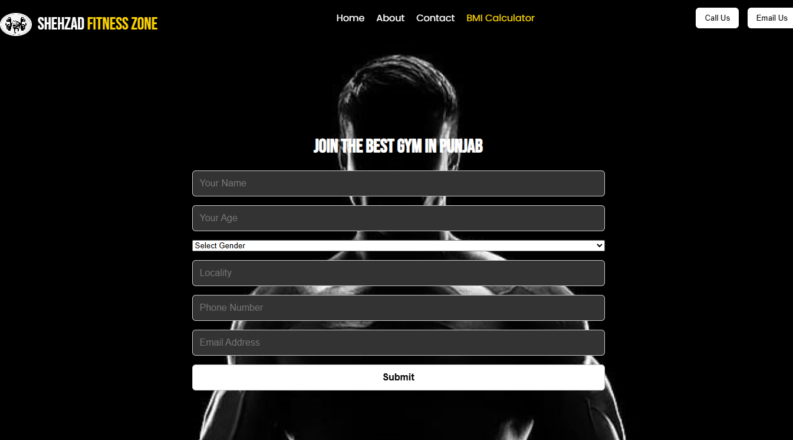
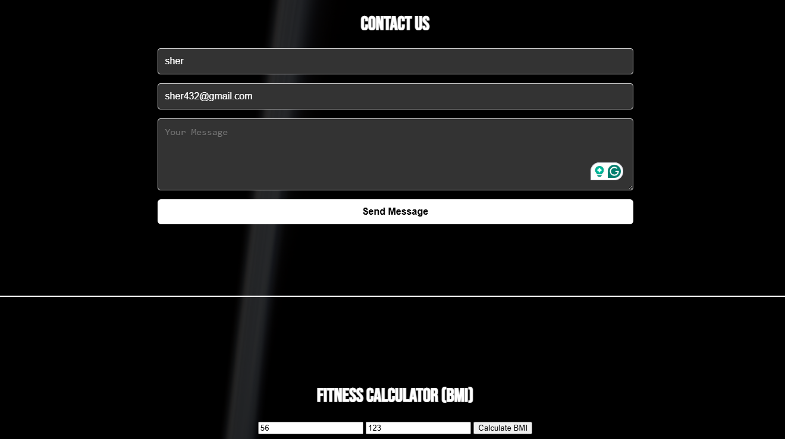

# 🏋️‍♂️ Gym Intro Page

A simple and responsive landing page for a Gym/Fitness Center using HTML and CSS.

## 🔗 Live Demo
👉 [Click here to visit the live site](https://gymsitegearup.netlify.app/?)

## Screenshots-
#### Home Page

#### About Page

## 📌 Features
- Fully responsive layout
- Hero section with background image
- About section
- Services section
- Contact info

## 🚀 How to Run
Open `index.html` in your browser.

## 📁 Technologies Used
- HTML
- CSS

---

✍️ Author: Mohd. Shehzad  
GitHub: [@ShehzadChouhan](https://github.com/ShehzadChouhan)
